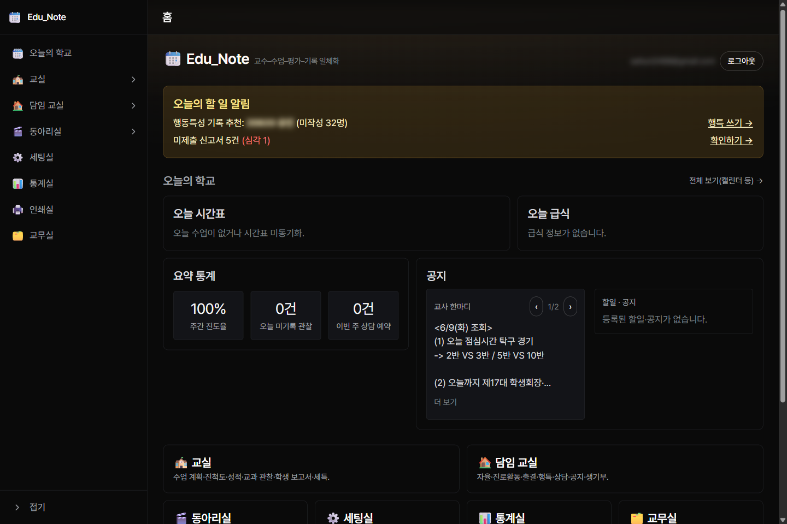
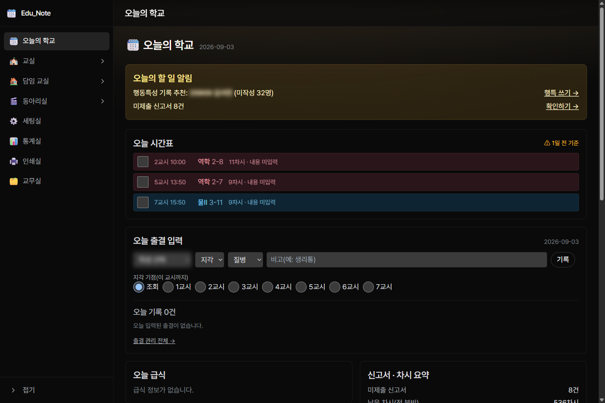
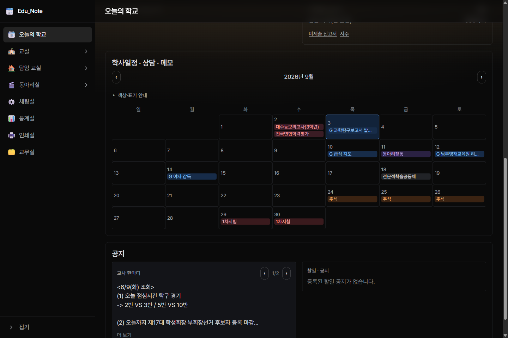
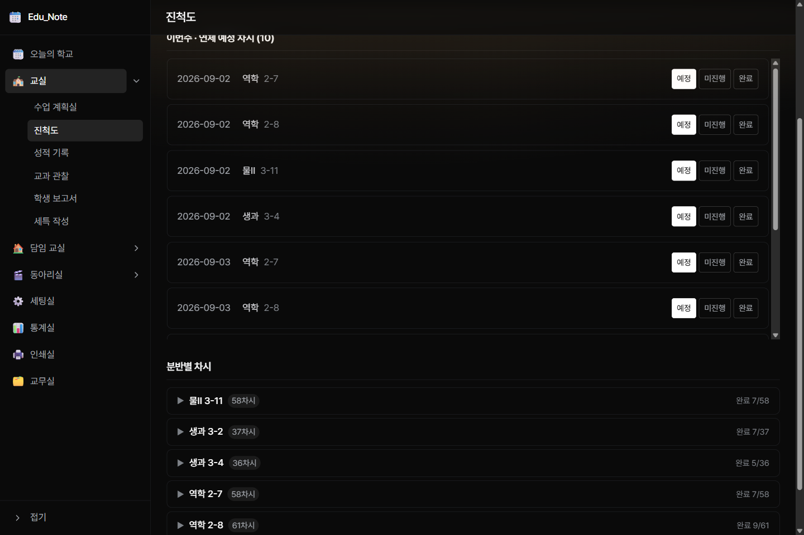
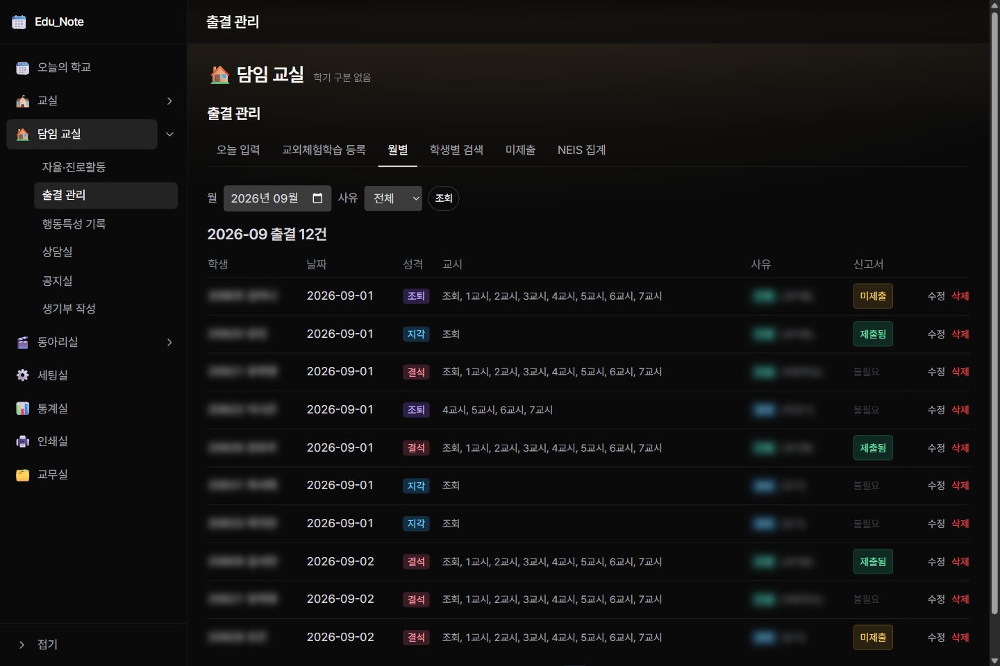
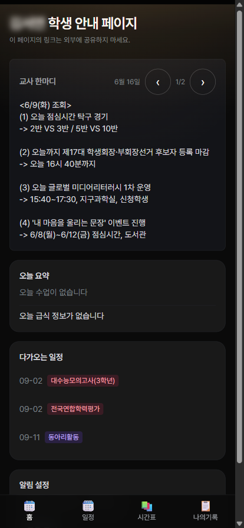

<div align="center">

# 📆 Edu_Note

**고등학교 교사를 위한, 나만의 교무 수첩**

수업 계획부터 출결·상담·생기부까지 — 학교 일을 한 곳에서.
서버도, 코딩도 필요 없이 **내 계정에 내 것으로** 설치합니다.

[](LICENSE)


</div>

---

> ### 🚧 지금은 준비 중입니다
> Edu_Note는 만든 사람이 **1년 넘게 실제 수업에서 매일 쓰고 있는** 앱입니다.
> 다만 "누구나 클릭 한 번으로 설치" 기능은 **v1.0에서 공개 예정**이며 지금 마무리 중입니다.
> 아래 설치 버튼은 v1.0 릴리스와 함께 동작합니다.
> 소식을 받고 싶으시면 이 저장소 오른쪽 위 **Watch → Releases only**를 눌러 주세요.

---

<div align="center">



<sub>실제 사용 중인 화면입니다. 학생 이름·이메일 등 개인정보는 흐리게 처리했습니다.</sub>

</div>

---

## 이런 경험, 있으시죠

> 3교시 수업 중에 학생이 지각했다. 메모지에 적어뒀는데 그 메모지가 없다.
>
> 세특 쓸 때가 됐다. 한 학기 동안 아이들이 뭘 했는지 기억이 안 난다.
> 수행평가 파일, 관찰 메모, 활동 사진이 각각 다른 폴더에 흩어져 있다.
>
> 결석계를 안 낸 학생이 몇 명이더라. 언제까지가 마감이었지.
>
> 학생이 "선생님, 오늘 몇 교시에 뭐 해요?" 하고 열 번쯤 물어본다.

**Edu_Note는 이 흩어진 것들을 하나로 모읍니다.**
엑셀 파일도, 메모 앱도, 카톡 나에게 보내기도 더는 필요 없습니다.

---

## 무엇이 다른가요

|  | Edu_Note |
|---|---|
| 💰 **완전 무료** | 무료 한도 안에서 씁니다. 결제 정보를 넣을 일이 없습니다. |
| 🔐 **내 데이터는 내 것** | 학생 정보가 제 서버로 오지 않습니다. **선생님 계정에 만든 선생님의 데이터베이스**에만 저장됩니다. 저는 볼 수 없습니다. |
| 🔗 **학교 시스템과 연결** | 나이스 학사일정·급식, 컴시간알리미 시간표를 **자동으로 가져옵니다.** 손으로 옮겨 적지 않습니다. |
| 📱 **폰에서 그대로** | 홈 화면에 추가하면 앱처럼 열립니다. 교실에서 폰으로 출결을 찍습니다. |
| 👨‍👩‍👧 **학생·학부모 전용 화면** | 링크 하나만 주면 그 학생 것만 보입니다. 앱 설치도, 로그인도 필요 없습니다. |
| 🧑‍🏫 **현직 교사가 만듦** | 기능 하나하나가 실제로 불편해서 만든 것입니다. |

---

## 하루가 이렇게 흘러갑니다

### 🗓️ 아침 — 오늘의 학교

앱을 열면 **오늘 할 일만** 보입니다.

- 오늘 내 수업 시간표 (방학이면 "방학"이라고 알려줍니다)
- 오늘 급식
- 이번 주 진도율
- 놓친 일 알림 — *"관찰기록 3명 미작성"*, *"결석계 2건 마감 임박"*
- 담임이라면, **우리 반 출결을 이 화면에서 바로** 찍을 수 있습니다



같은 화면을 내리면 **학사일정 달력**이 있습니다.
나이스에서 가져온 학사일정·방학, 내 구글 캘린더 일정(`G` 표시), 직접 쓴 메모가 한 장에 겹쳐 보입니다.



### 🏫 수업 — 교실

| 기능 | 하는 일 |
|---|---|
| **수업 계획실** | 학기 진도 계획을 세우고, 차시별 수업 내용을 기록합니다 |
| **진척도** | 시험 날짜를 넣으면 **남은 차시가 자동 계산**됩니다. "진도 맞출 수 있나?"에 숫자로 답합니다 |
| **성적 기록** | 수행평가·지필 점수를 반영 비율대로 관리합니다 |
| **교과 관찰** | 수업 중 발견한 학생의 모습을 그때그때 메모합니다 |
| **학생 보고서** | 한 학생의 모든 기록을 한 장으로 모아 봅니다 |
| **세특 작성** | 흩어진 관찰·수행 기록을 모아 **초안 작성을 도와줍니다** (아래 설명) |

**"진도 맞출 수 있나?"에 숫자로 답합니다.** 시험 날짜만 넣으면 분반별 남은 차시가 자동 계산됩니다.



### 🏠 담임이라면 — 담임 교실

| 기능 | 하는 일 |
|---|---|
| **출결 관리** | 교시별 출결을 찍고 **월 단위로 마감**합니다. 나이스 입력 순서 그대로 정리해 줍니다 |
| **서류 챙기기** | 결석계·교외체험 보고서 마감을 **수업일 기준으로 계산**해 재촉해 줍니다. 주말·공휴일을 빼고 셉니다 |
| **자율·진로활동** | 활동을 기록하고 학생별로 배정합니다 |
| **행동특성 기록** | 관찰한 것을 쌓아두었다가 학년말에 씁니다 |
| **상담실** | 상담 일정을 잡고 일지를 남깁니다. **학생이 링크로 직접 상담 신청**할 수 있습니다 |
| **공지실** | 학급 공지를 올리면 학생 화면에 바로 뜹니다 |
| **생기부 작성** | 쌓인 기록으로 생기부 문구를 씁니다. **글자 수(바이트)를 실시간으로 세어 줍니다** |

출결은 **누가 · 언제 · 어떤 성격으로 · 몇 교시** 빠졌는지가 한 줄에 정리되고,
증빙 서류 제출 여부(`제출됨` / `불필요`)까지 같은 줄에서 확인됩니다.



### 🎬 동아리 · 📊 통계 · 🖨️ 인쇄 · 🗂️ 교무실

- **동아리실** — 개설 → 부원 배정 → 활동 계획 → 활동 입력 → 생기부까지 한 줄로
- **통계실** — 출결·진도·기록 현황을 한눈에
- **인쇄실** — 명렬표, 학생별 개인 자료를 **인쇄용으로 뽑습니다**
- **교무실** — 업무와 예산을 관리합니다

### ✍️ 세특 작성 — AI에게 맡기되, 검수는 내가

Edu_Note는 학생의 **관찰기록·수행평가·활동 내역**과 **NEIS 기재요령 지침**을 하나의 글로 묶어 줍니다.
이걸 쓰시는 AI(챗GPT, 클로드 등)에 붙여넣으면 초안이 나옵니다.
그 결과를 다시 앱에 붙여넣으면 **글자 수 초과와 기재 금지 표현을 자동으로 검사**한 뒤 저장합니다.

> 💡 **AI 요금을 내지 않아도 됩니다.** 앱이 AI를 직접 호출하지 않고, 이미 쓰고 계신 AI에
> 붙여넣는 방식이라 추가 비용이 없습니다. 무엇보다 **최종 문장은 선생님이 확인하고 저장**합니다.

---

## 👨‍👩‍👧‍👦 학생과 학부모가 보는 화면

학생마다 **개인 링크**를 하나씩 발급합니다. 카톡으로 보내주면 끝입니다.
앱 설치도, 회원가입도, 로그인도 필요 없습니다.

학생 화면은 4개 탭입니다.

| 탭 | 보이는 것 |
|---|---|
| **오늘의 학교** | 오늘 시간표, 오늘 급식, 새 공지, 서류 제출 알림 |
| **시간표** | 이번 주 시간표 (선택과목은 본인 것으로) |
| **일정** | 학사일정, 수행평가·시험 날짜 |
| **나의기록** | 본인 출결 현황, 받은 공지, 상담 신청 |

<div align="center">



<sub>학생이 폰에서 링크를 열었을 때의 화면</sub>

</div>

**개인정보는 꼭 필요한 것만 나갑니다.** 출결은 *횟수*만 보이고 사유는 나가지 않습니다.
다른 학생의 정보는 어떤 방법으로도 보이지 않습니다. 링크는 언제든 폐기할 수 있고,
검색엔진에도 잡히지 않습니다.

---

## 🚀 설치하기

<div align="center">

### [](https://vercel.com/new/clone?repository-url=https%3A%2F%2Fgithub.com%2FsehunYang%2Fedu-note&project-name=edu-note&repository-name=edu-note&stores=%5B%7B%22type%22%3A%22integration%22%2C%22integrationSlug%22%3A%22supabase%22%2C%22productSlug%22%3A%22supabase%22%2C%22protocol%22%3A%22storage%22%7D%5D&env=ALLOWED_EMAIL&envDescription=%EB%A1%9C%EA%B7%B8%EC%9D%B8%EC%97%90+%EC%82%AC%EC%9A%A9%ED%95%A0+%EB%B3%B8%EC%9D%B8+%EC%9D%B4%EB%A9%94%EC%9D%BC%EC%9D%84+%EC%9E%85%EB%A0%A5%ED%95%98%EC%84%B8%EC%9A%94.+%EC%9D%B4+%EC%A3%BC%EC%86%8C%EB%A1%9C%EB%A7%8C+%EB%A1%9C%EA%B7%B8%EC%9D%B8%ED%95%A0+%EC%88%98+%EC%9E%88%EC%8A%B5%EB%8B%88%EB%8B%A4.&envLink=https%3A%2F%2Fgithub.com%2FsehunYang%2Fedu-note%2Fblob%2Fmain%2Fdocs%2FINSTALL.md)

**약 10분. 터미널도, 코딩도 없습니다.**

</div>

### 준비물 딱 3가지

1. **GitHub 계정** — 무료. 이메일만 있으면 가입됩니다
2. **Vercel 계정** — 무료. GitHub 계정으로 바로 로그인됩니다
3. **본인 이메일** — 로그인할 때 씁니다

### 이렇게 진행됩니다

```
①  위 [Deploy] 버튼 클릭
      ↓
②  GitHub 로그인 → 내 계정에 앱 복사본이 생깁니다
      ↓
③  [Create] 클릭 → 내 데이터베이스가 자동으로 만들어집니다 (무료·서울)
      ↓
④  칸 하나만 채웁니다 — 본인 이메일 (여기로 로그인합니다)
      ↓
⑤  [Deploy] 클릭 → 3~5분 기다립니다 ☕
      ↓
⑥  만들어진 주소로 접속 → 안내에 따라 마무리 (붙여넣기 한 번)
      ↓
⑦  이메일로 온 링크를 눌러 로그인 → 끝! 🎉
```

로그인한 뒤에는 **세팅실**이 학교 정보·학년도·시간표·학생 명단을 순서대로 물어봅니다.
학교 이름만 검색하면 학사일정과 급식이 자동으로 채워집니다.

👉 **화면 사진과 함께 보는 자세한 설치 안내: [docs/INSTALL.md](docs/INSTALL.md)**

<!-- TODO(v1.0): 설치 화면 스크린샷 3~4장을 docs/images/ 에 추가하고 여기에 삽입 -->

### 나이스 인증키는 어디서 받나요?

[나이스 교육정보 개방포털](https://open.neis.go.kr)에서 가입 후 즉시 무료 발급됩니다.
학사일정과 급식을 자동으로 가져오는 데 씁니다. **없어도 앱은 정상 동작하고**,
나중에 앱 안 **세팅실 → 시스템 상태**에서 붙여넣으면 바로 켜집니다.

---

## 💸 비용은 정말 안 드나요

네. 교사 한 명이 한 반~여러 학급을 운영하는 정도는 **무료 한도 안에 넉넉히 들어옵니다.**

| 서비스 | 역할 | 요금 |
|---|---|---|
| Vercel | 앱이 돌아가는 곳 | 무료 (Hobby) |
| Supabase | 데이터가 저장되는 곳 | 무료 (500MB·서울) |
| 나이스 개방포털 | 학사일정·급식 | 무료 |
| 컴시간알리미 | 시간표 | 무료 |

결제 수단을 등록하는 단계가 아예 없습니다. 한도를 넘으면 요금이 청구되는 게 아니라
**멈춥니다.** 모르는 사이에 돈이 나갈 일이 없습니다.

> ℹ️ Vercel 무료 플랜은 개인의 비영리 사용을 위한 것입니다. 교사 개인이 본인 수업을
> 위해 쓰는 용도에 해당합니다.

---

## 🔒 개인정보와 보안

학생 정보를 다루는 도구입니다. 이 부분은 분명하게 말씀드리겠습니다.

### 제 서버는 없습니다

Edu_Note는 **제가 운영하는 서버가 없습니다.** 선생님이 설치하면 선생님의 Vercel과
선생님의 데이터베이스에 앱이 만들어집니다. 학생 데이터는 그 안에만 있습니다.
**저는 접근할 수 없고, 어떤 데이터도 저에게 전송되지 않습니다.**

### 그래서 책임도 선생님께 있습니다

설치한 데이터베이스의 주인은 선생님이므로, **학생 개인정보의 처리 주체도 선생님**입니다.
소속 학교의 개인정보 지침을 확인하고, 필요하면 정보부장·개인정보보호 담당자와 상의하신 뒤
사용하시기를 권합니다. 백업 기능이 있으니 정기적으로 내려받아 두세요.

👉 어떤 정보가 어디로 오가는지 전부 정리해 두었습니다: **[docs/PRIVACY.md](docs/PRIVACY.md)**

### 이런 보호 장치가 있습니다

- **오직 본인만 로그인** — 설치할 때 적은 이메일 외에는 계정 생성 자체가 막힙니다
- **데이터베이스 차원의 잠금** — 모든 테이블이 소유자 본인에게만 열립니다 (RLS)
- **학생 링크 최소 공개** — 그 학생의, 꼭 필요한 항목만 나갑니다. 출결 사유·다른 학생 정보·
  내부 식별자는 어떤 경우에도 나가지 않습니다 (자동 테스트로 확인합니다)
- **링크 폐기·만료** — 유출이 의심되면 즉시 끊을 수 있습니다
- **검색 차단** — 학생 페이지는 검색엔진에 잡히지 않습니다
- **기록 남김** — 명단 업로드, 링크 발급·폐기 등 민감한 작업은 이력이 남습니다

---

## 🔄 업데이트

**대부분의 업데이트는 저절로 반영됩니다.** 매일 새벽에 새 버전을 확인해 알아서
받아서 배포합니다. 선생님은 아무것도 하지 않으셔도 됩니다.

딱 한 경우만 예외입니다 — **데이터가 사라질 수 있는 변경**이 포함되면 자동으로
반영하지 않고 확인을 요청합니다.

앱 안 **세팅실 → 시스템 상태**에서도 새 버전 여부를 확인할 수 있습니다.
자세한 절차: [docs/UPDATE.md](docs/UPDATE.md)

> 학교 시스템(나이스·컴시간)이 형식을 바꾸면 앱이 잠깐 멈출 수 있습니다.
> 그럴 때 제가 고쳐서 올리면, 여러분은 [Merge]만 누르시면 됩니다.

---

## ❓ 자주 묻는 질문

<details>
<summary><b>컴퓨터를 켜둬야 하나요?</b></summary><br>

아니요. 인터넷에 올라가 있어서 폰·학교 컴퓨터·집 컴퓨터 어디서든 주소만 열면 됩니다.
</details>

<details>
<summary><b>코딩을 전혀 모르는데 괜찮을까요?</b></summary><br>

네. 설치는 버튼 클릭과 칸 채우기뿐입니다. 터미널을 열거나 파일을 편집할 일이 없습니다.
막히면 [Issues](https://github.com/sehunYang/edu-note/issues)에 남겨 주세요.
</details>

<details>
<summary><b>학생들이 앱을 깔아야 하나요?</b></summary><br>

아니요. 링크를 열면 바로 보입니다. 로그인도 필요 없습니다.
폰 홈 화면에 추가하면 앱처럼 쓸 수 있지만, 선택입니다.
</details>

<details>
<summary><b>학교를 옮기면 어떻게 하나요?</b></summary><br>

세팅실에서 학교와 학년도를 새로 지정하면 됩니다. 이전 기록은 그대로 남습니다.
</details>

<details>
<summary><b>다른 선생님과 같이 쓸 수 있나요?</b></summary><br>

지금은 **한 분이 하나씩** 설치해 쓰는 구조입니다. 각자 설치하시면 각자의 데이터가
완전히 분리됩니다. 여러 교사가 한 앱을 공유하는 기능은 없습니다.
</details>

<details>
<summary><b>중학교·초등학교에서도 되나요?</b></summary><br>

고등학교(특히 교과 담당 + 담임)를 기준으로 만들었습니다. 나이스 학사일정·급식처럼
학교급과 무관한 기능은 동작하지만, 생기부·세특·수행평가 부분은 고등학교 기준입니다.
</details>

<details>
<summary><b>데이터를 내보낼 수 있나요?</b></summary><br>

네. 앱 안에서 전체 백업을 파일로 내려받을 수 있습니다. 데이터베이스도 선생님 것이라
Supabase에서 직접 내보내는 것도 가능합니다.
</details>

<details>
<summary><b>기능을 추가해 달라고 해도 되나요?</b></summary><br>

환영합니다. [Issues](https://github.com/sehunYang/edu-note/issues)에
"어떤 상황에서 무엇이 불편한지"를 적어 주세요. 기능 이름보다 **상황**이 훨씬 도움이 됩니다.
</details>

---

## 🤝 도움이 필요하거나, 돕고 싶다면

- **설치가 안 될 때** — 앱 안 **세팅실 → 시스템 상태**가 무엇이 빠졌는지 알려줍니다.
  그래도 안 되면 [docs/TROUBLESHOOTING.md](docs/TROUBLESHOOTING.md)를 보시고,
  [Issues](https://github.com/sehunYang/edu-note/issues)에 화면 사진과 함께 남겨 주세요
- **버그를 찾았을 때** — 어떤 화면에서 무엇을 눌렀을 때 어떻게 됐는지 적어 주시면 큰 도움이 됩니다
- **코드로 돕고 싶을 때** — Pull Request 환영합니다

---

<details>
<summary><h2 style="display:inline">🛠️ 개발자를 위한 정보</h2></summary>

### 스택

| 레이어 | 선택 |
|---|---|
| 프레임워크 | Next.js 15 (App Router) · React 19 · TypeScript |
| 스타일 | Tailwind CSS |
| DB | Supabase Postgres (서울) · Drizzle ORM · 전 테이블 RLS |
| 인증 | Supabase Auth (이메일 매직링크 · 구글 선택) |
| 외부 연동 | 컴시간알리미(시간표) · 나이스 개방포털(학사일정·급식) — 서버 전용·읽기 전용 |
| 배포 | Vercel |
| 테스트 | Vitest (단위 + 실DB 통합) |

### 디렉터리

```
app/(shell)/      교사용 9개 공간 (오늘의학교·교실·담임교실·동아리실·세팅실·통계실·인쇄실·교무실)
app/p/[token]/    학생 공개 페이지 (4탭, 인증 없음)
app/print/        인쇄 전용 레이아웃
lib/domain/       순수 규칙 — 바이트 계산·출결·서류 에스컬레이션·잔여차시·넛지 (테스트 가능)
lib/db/           Drizzle 스키마 · 손작성 SQL 마이그레이션 · ownerId 인자형 쿼리 계층
lib/integrations/ 컴시간·나이스·구글 캘린더 어댑터 (server-only fetch + 순수 파서)
lib/setech/       세특 프롬프트 번들 어셈블러 + 붙여넣기 검수
lib/public/       공개 페이지 service-role 어댑터 + allowlist DTO
content/          세특 작성 지침 (레포 자산)
```

### 로컬 실행

```bash
npm install
cp .env.example .env.local   # 값 채우기
npm run dev
```

### 명령어

```bash
npm run typecheck            # tsc --noEmit
npm test                     # Vitest (단위)
npm run scan:secrets         # 클라이언트 번들 시크릿 유출 검사
npm run build                # 프로덕션 빌드 (마이그레이션 자동 적용 포함)

npm run db:migrate:status    # 미적용 마이그레이션 조회 (쓰기 없음)
npm run db:migrate           # 미적용분 적용
npm run db:migrate:selftest  # 러너 자체 검증 (스크래치 테이블만 사용)
```

실DB 통합 테스트는 `RUN_DB_ITEST=1` + `DATABASE_URL`이 있을 때만 돕니다.

### 설계 원칙

- **공개 표면 최소화** — `/p/[token]`은 RLS를 우회하는 service-role로 동작하므로,
  단일 `get_public_page(token)` SQL 함수 + 사전집계 allowlist DTO가 유일한 보호막이다.
  출결 사유·원점수·타 학생 데이터·내부 ID는 절대 직렬화하지 않으며 골든 페이로드 테스트로 단언한다.
- **fail-closed** — 인증 환경변수가 없으면 통과가 아니라 **전면 차단**한다.
- **마이그레이션은 손작성 + 자동 적용** — `db:generate`는 쓰지 않는다(스냅샷이 어긋나
  누적 마이그레이션이 나온다). `lib/db/migrations/00NN_*.sql`을 직접 쓰면
  `scripts/migrate.mjs`가 빌드 단계에서 미적용분만 순서대로 적용하고
  `schema_migrations`에 기록한다. 파일 단위 트랜잭션 + `pg_advisory_xact_lock`.
  - 적용된 파일을 나중에 **수정하면 빌드가 중단된다**(체크섬 불일치). 변경은 새 파일로.
  - 데이터가 사라질 수 있는 마이그레이션은 헤더 주석에 `DESTRUCTIVE`를 적는다 —
    러너가 경고를 띄우고, 업데이트 PR 본문에 표시된다.
  - 프리뷰 빌드에서는 실행되지 않는다. 프로덕션 빌드인데 DB 접속 정보가 없으면
    조용히 넘어가지 않고 **빌드를 실패**시킨다.
- **연도 분리 모델** — 영속 학생(`persons`) ↔ 연도별 학적(`student_years`)으로
  학년이 바뀌어도 기록이 이어진다.

</details>

---

## 📄 라이선스

[MIT](LICENSE) — 자유롭게 쓰고, 고치고, 나눠 주세요.

## ⚠️ 면책

이 소프트웨어는 **있는 그대로(as-is)** 제공됩니다. 설치·운영·데이터 관리의 책임은
설치하신 분에게 있습니다. **공식 기록은 반드시 나이스(NEIS)에 입력하시고**, Edu_Note는
그 과정을 돕는 보조 도구로 사용해 주세요. 중요한 데이터는 정기적으로 백업하시기 바랍니다.

---

<div align="center">

**교실에서 쓰려고 만들었습니다. 도움이 되면 좋겠습니다.**

⭐ 쓸 만하다고 느끼셨다면 Star를 눌러 주세요 — 다른 선생님들이 찾는 데 도움이 됩니다.

</div>
